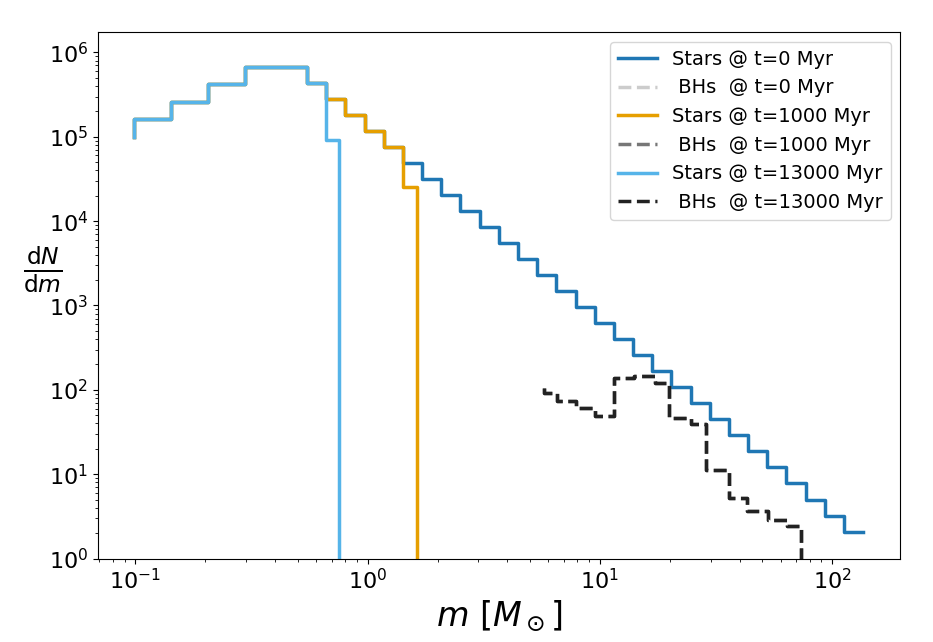

Welcome to the documentation of SSPTools!
==========================================

:Release: |release|
:Date: |today|

SSPTools is a Python package which provides a number of fast, useful tools
surrounding the creation and evolution of the stellar mass function of a
*Simple Stellar Population* (SSP).

In particular, this package provides a number of classes which represent the
*present-day mass function* (PDMF) of some stellar population at a given age,
and are the product of some arbitrary initial mass function (IMF) and a number
of physical, evolutionary processes such as stellar evolution, tidal stripping
and black hole ejections.

The majority of this package is based upon *binned* mass components, and it is
primarily designed to be used to populate rapid multi-mass models of objects
such as star clusters, however it also includes a number of other handy tools
for dealing with SSPs.

Quickstart
-----------

An evolved mass function can be computed using the `EvolvedMF` class:

.. code-block:: python

   >>> import ssptools

   >>> m_break, a_slopes, nbins = [0.08, 0.5, 150.], [+1.3, -2.3], [5, 5]
   >>> pdmf = ssptools.EvolvedMF.from_powerlaw(m_break, a_slopes, nbins, FeH=-1.5, tout=13000, esc_rate=0, N0=1e6)

Alternatively, an IMF class can be instantiated and used directly:

.. code-block:: python

   >>> imf = ssptools.masses.PowerLawIMF(m_break, a_slopes, N0=1e6)
   >>> imf
   PowerLawIMF(m_break=[8.0e-02 5.0e-01 1.5e+02], a=[ 1.3 -2.3], N0=1000000.0)

   >>> pdmf = ssptools.EvolvedMF(imf, nbins, FeH=-1.5, tout=[0, 1000, 13000], esc_rate=0)

There are also a number of alternative classes for task such as rapidly
computing only the initially formed BHs.
See the documentation of each class for more details on all possible parameters.
.. TODO insert :class: links

The final element of `tout` (in Myr) defines the age to which the mass function
is evolved to, where the masses and numbers of stars and remnants (together)
can then be accessed easily:

.. code-block:: python

   >>> pdmf.N  # Total number of stars in each bin
   array([ 7100.11465725, 16495.67798267, 38324.36590725, ...,
             98.3951835 ,    71.26765432,   129.22558372], shape=(28,))

   >>> pdmf.M  # Total mass of stars in each bin
   array([ 703.58413557, 2358.28804747, 7904.5592896 , ..., 4232.92165804,
          3760.88012354, 8348.46232892], shape=(28,))

   >>> pdmf.m  # Mean mass of stars in each bin
   array([ 0.09909476,  0.142964  ,  0.20625414, ..., 43.01960226,
          52.77120679, 64.60378888], shape=(28,))

   >>> pdmf.M[pdmf.types == 'MS']  # Star bins only
   array([  703.58413557,  2358.28804747,  7904.5592896 , 26494.66744731,
          88805.38147994, 77187.10329204, 72907.72223297, 20817.88440062])

   >>> pdmf.M[pdmf.types == 'BH']  # Black hole bins only
   array([ 455.5374004 , 1493.36148456, 1775.31338462, ..., 4232.92165804,
          3760.88012354, 8348.46232892], shape=(14,))

Note that the size of these summary attributes may not match the initial number
of mass bins because empty bins (N<0.1) are stripped.

All other outputted times can also be seen in the underlying attributes, which
generally have shape (`len(tout)`, `sum(nbins)`).

.. code-block:: python

   >>> pdmf.Ns[0]  # Initial star bin amounts
   array([7.10011466e+03, 1.64956780e+04, 3.83243659e+04, ...,
          9.78765378e-02, 9.84868914e-02, 9.83371111e-02], shape=(35,))

   >>> pdmf.Ns[-1]  # Final star bin amounts
   array([7.10011466e+03, 1.64956780e+04, 3.83243659e+04, ...,
          9.78765378e-02, 9.84868914e-02, 9.83371111e-02], shape=(35,))

   >>> pdmf.Mr  # Named tuple with fields ('WD', 'NS', 'BH')
   rem_classes(
      WD=array([[    0.        ,     0.        ,     0.        , ...,
                 36383.17671296, 32689.91310442, 20902.28985205]], shape=(1, 10)),
      NS=array([[3362.62294159]]),
      BH=array([[ 455.5374004 , 1493.36148456, 1775.31338462, ...,
                    0.        ,    0.        ,    0.        ]], shape=(1, 18))
   )

   >>> pdmf.Mr.BH[-1]  # Final BH bin masses
   array([ 455.5374004 , 1493.36148456, 1775.31338462, ...,
             0.        ,    0.        ,    0.        ], shape=(18,))

.. code-block:: python

   >>> import matplotlib.pyplot as plt

   >>> for i in range(pdmf.nout):
   >>>     mes = pdmf.massbins.turned_off_bins(pdmf.tout[i])  # mass bins at t_i
   >>>     ln = plt.step(pdmf.ms[i], pdmf.Ns[i] / (mes.upper - mes.lower),
   >>>                   ls='-', label=f"Stars @ t={pdmf.tout[i]} Myr")
   >>>     mebh = pdmf.massbins.bins.BH  # BH mass bins
   >>>     ln = plt.step(pdmf.mr.BH[i], pdmf.Nr.BH[i] / (mebh.upper - mebh.lower),
   >>>                   ls='--', c=str(0.8 * 1 - (i / pdmf.nout)),
   >>>                   label=f" BHs  @ t={pdmf.tout[i]} Myr")

   >>> plt.ylabel(r"$\frac{\mathrm{d}N}{\mathrm{d}m}$", rotation=0)
   >>> plt.xlabel(r"$m\ [M_\odot]$")
   >>> plt.yscale('log'); plt.xscale('log')
   >>> plt.ylim(bottom=1)
   >>> plt.legend()
   >>> plt.show()

Contents
--------

.. toctree::
   :maxdepth: 2

   Installation <installation>
   Algorithms <algorithms>
   Usage and Examples <usage>
   API <ref/api>
   Citing <citations>

.. TODO what do these do?
Indices and tables
==================
* :ref:`genindex`
* :ref:`modindex`
* :ref:`search`
